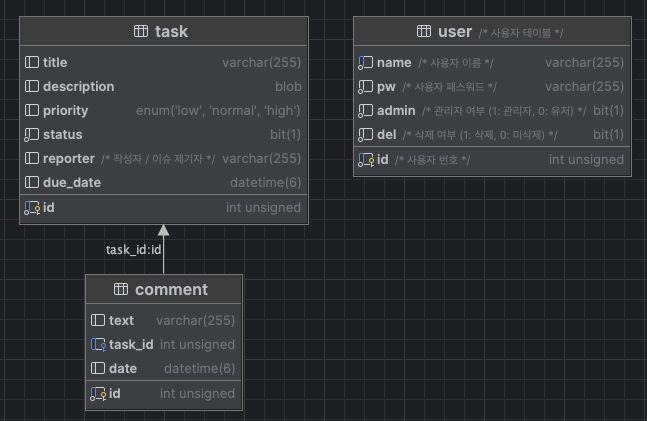

# TodoTask

<small>A simple todo list application that keeps track of your time.</small>

## How To
- 빌드하여 패키징 하여 실행 후 접근 시에는 http://locahost:8080으로 접근 하세요.
- Backend와 Frontend를 별도로 실행하여 접근시에는 http://localhost:8081 로 접근하세요. 서버의 접근 주소는 http://localhost:8080 이 됩니다.
- `spring.sql.init.mode=always`로 설정 되어 있으며, 초기 데이터가 있습니다.
  - admin/1234 로 계정이 미리 생성 되어 있습니다.
  - user1/1234 로 일반 접속자 계정 또한 생성 되어 있습니다. 
  - 별도의 계정을 원하는 경우 접근하여, 메뉴에서 유저관리 메뉴를 이용해주세요.
- Gradle로 빌드시 Front-end의 빌드된 청크가 `static` 디렉토리로 이동 합니다.
- Database 생성 방법은 `main/resources` 에서 init.sql 파일을 참고 해주세요. 

### Run

```bash
cd todo-task
./gradlew bootRun
cd frontend
npm run serve

# Access the app on http://localhost:8081/
```
위의 방법으로 실행 할때는  http://locahost:8081 로 front-end 서버에 접근 하고, http://localhost:8080 으로 back-end 서버에 접근 합니다.

### Build

```bash
./gradlew clean

# Note the -P flag to build the client code
./gradlew build -x test -Pfrontend

java -jar ./build/libs/todo-task-1.0.0-SNAPSHOT.jar
```
위의 방법으로 실행 할때는  http://locahost:8080 로 서버가 하나만 생성 됩니다.

### Docker
```bash
docker-composer up -d
```
위와 같이 실행시 MySQL, Backend, Frontend 컨테이너가 각각 하나씩 실행 됩니다.
http://localhost:8000/ 로 실행하여 FrontEnd 확인이 가능합니다.


## Schema


